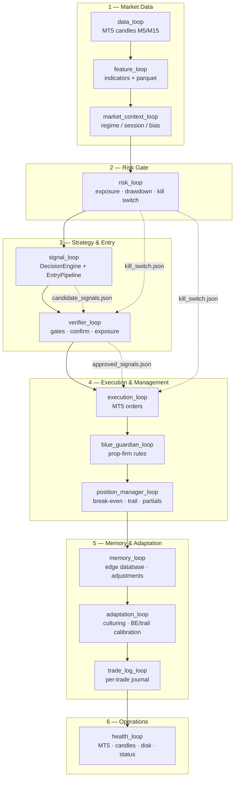
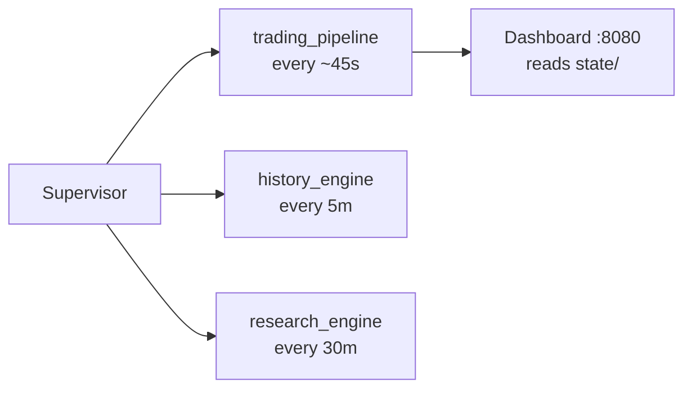
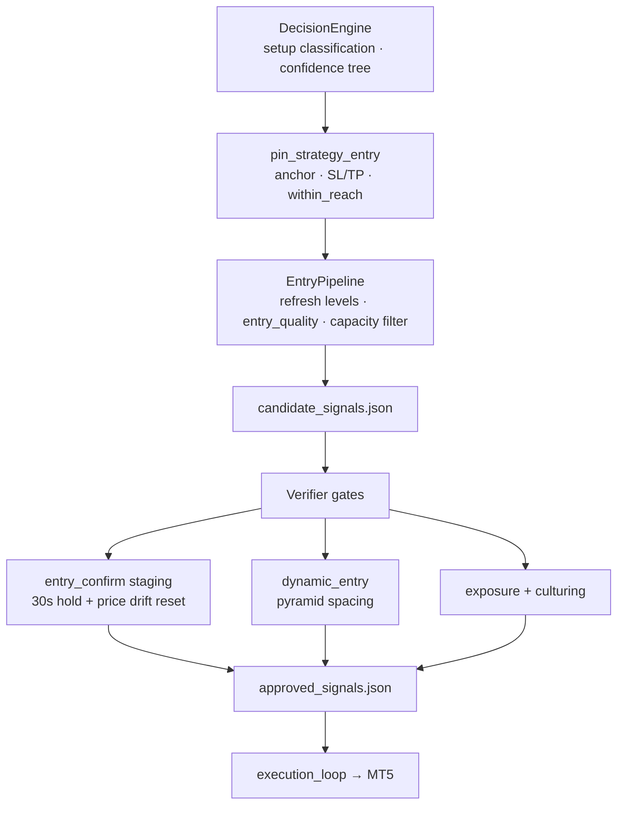
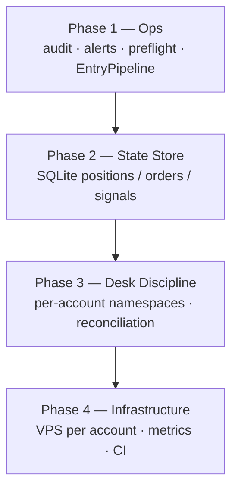

# MT5 Quant OS Update: Phase 1 Ops Hardening + Entry Pipeline Refinement

Back to [README](../README.md) · [Pipeline](PIPELINE.md) · [How to run](HOW_TO_RUN.md)

Pushed to GitHub:

```text
Commit: 65de9dfbe15e5862328d6882a1eee4ee02b9e994
Branch: blue-guardian
Focus: Phase 1 ops hardening, entry pipeline refinement, and pipeline documentation
```

This update turns the bot from a working MT5 execution system into a more controlled **Quant OS trading pipeline** with better operational safety, clearer auditability, stronger entry filtering, and a documented roadmap.

---

## 1. Pipeline diagram

### Main trading cycle

The main trading cycle runs roughly every **45 seconds**. Each supervisor tick moves through market data, risk, strategy, execution, learning, and operations.



### Background services

The trading pipeline is not the only thing running. The supervisor also drives background services for history, research, and dashboard state.



---

## 2. Entry strategy flow

The biggest strategic upgrade in this phase is the new entry path. Instead of generating a signal and throwing it straight at the verifier, the bot now runs a dedicated **EntryPipeline** between the decision engine and verifier.



### What changed in the entry path

Before this phase, the bot could generate decent signals, but entry quality was more exposed to timing noise.

Now the bot has a cleaner sequence:

```text
DecisionEngine
   ↓
pin_strategy_entry
   ↓
EntryPipeline
   ↓
candidate_signals.json
   ↓
Verifier
   ↓
entry_confirm / dynamic_entry / exposure checks
   ↓
approved_signals.json
   ↓
MT5 execution
```

This means the bot can now ask better questions before a trade reaches MT5:

```text
Is the symbol already at max open capacity?
Is the entry still close enough to the anchor?
Has price drifted away from the setup?
Is the limit entry reachable?
Is this candidate better than the others?
Should this be staged, refreshed, or dropped?
```

---

## 3. Summary of what was built

### Phase 1: operations hardening

| Area | File / component | Purpose |
|------|------------------|---------|
| Audit trail | `state/audit_log.jsonl` | Records approve/reject/orders/kill switch events |
| Ops alerts | `core/ops_alerts.py` | Optional webhook alerts (kill switch, health, execution errors) |
| Pre-flight check | `scripts/preflight.py` | Readiness before start or after account switch |
| Pipeline docs | [PIPELINE.md](PIPELINE.md) | Main pipeline, entry flow, state files, roadmap |
| Run docs | [HOW_TO_RUN.md](HOW_TO_RUN.md) | Pre-flight and ops alert instructions |

### Why this matters

This adds operational discipline. The bot is no longer only trying to trade — it is starting to behave more like a trading desk:

```text
check readiness
record decisions
alert on danger
document the system
separate candidate signals from approved signals
protect execution with kill switch state
```

---

## 4. Entry improvements built

| Change | Effect |
|--------|--------|
| `EntryPipeline` in `signal_loop` | Extra refinement pass before verifier |
| Refresh levels each cycle | Re-pins entry, SL, and TP to latest structure |
| `entry_quality` score | Scores candidates 0–100 |
| Capacity filter | Skips symbols at `max_open_per_symbol` before verifier |
| Unreachable entry filter | Drops limit entries too far from anchor |
| `within_reach` exported | Decision engine passes reachability forward |
| Entry confirm drift reset | 30s staging timer resets if price drifts away |
| Micro profile tuning | `market_if_within_atr: 0.35`, `max_entry_wait_atr: 1.5` on `30-real` |
| Candidate sorting | Sort by `entry_quality`, then confidence |

### Entry quality logic

The scoring system prefers entries that are close to anchor, within reach, structure-aligned, momentum-aligned, M5-trend-aligned, and safe to stage.

Instead of ranking only by confidence, the bot asks: **which signal is both confident and executable at a good price?**

---

## 5. Why this entry upgrade matters

A weak bot: signal → immediate buy/sell.

This bot now:

```text
Signal → anchor → refresh each cycle → score quality → drop unreachable
→ stage confirmation → reset on drift → gates → execute
```

That reduces chasing and stops entries on setups that were valid earlier but whose price has already moved away.

---

## 6. State files in the hot path

| File | Writer | Reader |
|------|--------|--------|
| `features.json` | `feature_loop` | `signal_loop` |
| `candidate_signals.json` | `signal_loop` | `verifier_loop` |
| `approved_signals.json` | `verifier_loop` | `execution_loop` |
| `paper_positions.json` | execution / sync | risk, verifier, entry pipeline |
| `kill_switch.json` | `risk_loop` | verifier, execution |
| `audit_log.jsonl` | verifier, execution, risk | ops / forensics |

JSON is workable for Phase 1; **Phase 2 SQLite** is the main structural upgrade for multi-loop consistency.

---

## 7. Roadmap



| Phase | Focus | Examples |
|-------|-------|----------|
| Phase 1 ✅ | Ops hardening | audit, alerts, preflight, entry pipeline, docs |
| Phase 2 | State store | SQLite for positions, orders, signals |
| Phase 3 | Desk discipline | per-account namespaces, MT5 reconciliation |
| Phase 4 | Infrastructure | VPS-per-account, metrics, CI |

---

## 8. Recommended next steps

### Option A: Phase 2 SQLite (highest priority)

Replace hot JSON with tables for signals, orders, positions, journal, risk events, audit events. Less corruption, better queries, safer concurrent loops.

### Option B: Entry limit orders (high)

`use_limit_orders` when anchor is close but not at market; expire stale pendings; cancel on setup invalidation, spread widen, or ATR drift; dashboard staged-order panel.

### Option C: Discord / webhook alerts (medium for attended runs)

```yaml
ops:
  alerts:
    enabled: true
    webhook_url: "https://discord.com/api/webhooks/YOUR_WEBHOOK"
```

Alert on: kill switch, execution errors, health degraded, MT5 disconnect, drawdown, rejections.

---

## 9. Suggested build order

```text
1. SQLite state store
2. MT5 reconciliation job
3. Pending-order lifecycle
4. Dashboard entry-quality panel
5. Discord alerts fully wired
6. CI tests on push
7. VPS-per-account deployment
```

**Recommendation:** SQLite first, then limit orders and pending lifecycle, then alerts and VPS discipline.

---

## 10. Final review

Phase 1 delivers clearer documentation, ops readiness, audit logging, webhook alert hooks, pre-flight checks, entry refinement before verifier, entry quality scoring, capacity-aware filtering, unreachable-entry rejection, drift-aware confirmation, and better candidate ordering.

The biggest strategic win is **EntryPipeline** — the bot is less reactive and more selective.

**Discussion question:** Safer first (SQLite + reconciliation) or sharper entries first (limit orders + staged fills)?

**Recommendation:** SQLite first, then entry limit orders.