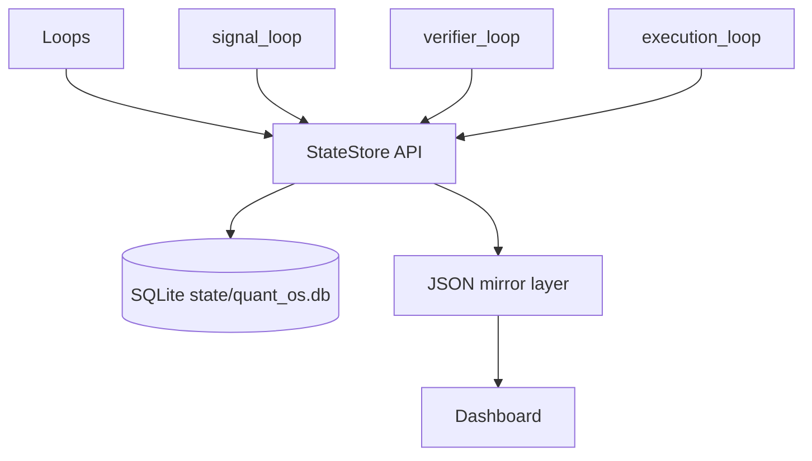

# Phase 2 — SQLite State Store

Back to [README](../README.md) · [Phase 1](PHASE1_UPDATE.md) · [Structure](STRUCTURE.md) · [Pipeline](PIPELINE.md)

Phase 2 adds a SQLite-backed state layer while **keeping JSON mirrors** so the dashboard and rollback path stay intact.

## Architecture



## Files added

| Path | Role |
|------|------|
| `core/state_schema.py` | Table DDL (signals, approved, rejected, orders, positions, trades, risk/audit, kv) |
| `core/state_store.py` | Read/write API + loop helpers |
| `scripts/migrate_json_state_to_sqlite.py` | Idempotent JSON → SQLite import |
| `tests/test_state_store.py` | Unit tests |

## Configuration

```yaml
state_store:
  enabled: true
  dual_write_json: true
  read_from_sqlite: true
  db_path: quant_os.db
```

Set `enabled: false` to roll back to JSON-only without removing code.

Database path resolves to `state/quant_os.db` (gitignored with `state/`).

## Dual-write flow

1. **signal_loop** — writes `candidate_signals.json` + SQLite `signals`
2. **verifier_loop** — reads candidates from SQLite (fallback JSON); writes approved/rejected to both
3. **execution_loop** — reads approved from SQLite (fallback JSON); syncs orders/positions/trades to both

Dashboard still reads JSON only (Phase 3 can add SQLite readers).

## Migration

```powershell
python scripts/migrate_json_state_to_sqlite.py
python scripts/preflight.py
```

Preflight initializes the DB, checks writability, and seeds from JSON mirrors when present.

## Acceptance checklist

- [x] Bot starts with `state_store.enabled: true`
- [x] signal_loop dual-writes candidates
- [x] verifier_loop reads/writes SQLite + JSON
- [x] execution_loop reads approved + syncs positions/orders/trades
- [x] JSON mirrors still update
- [x] preflight checks DB health
- [x] `pytest tests/test_state_store.py` passes

---

## Phase 2.1 — Exit classification (fixed)

`near_take_profit()` now uses **0.15% tolerance** (not 15%), checks **side direction**, and `trade_tracker` only labels `take_profit` when **PnL > 0**.

## Phase 2.2 — Evaluation loop

`evaluation_loop` runs after `signal_loop`, writes `evaluated_signals.json` + SQLite `evaluated_signals`. Verifier reads evaluated signals when `evaluation.enabled: true`.

Config:

```yaml
evaluation:
  enabled: true
  mode: shadow
  min_policy_score: 35
  skip_below_score: 25
```

Each evaluated signal carries `execution_policy` and `management_profile` for position manager.