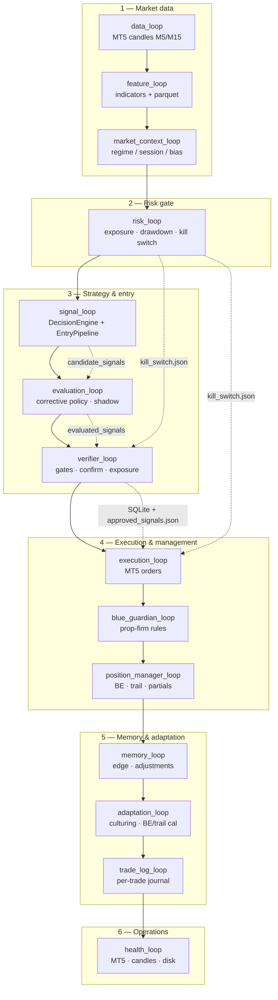
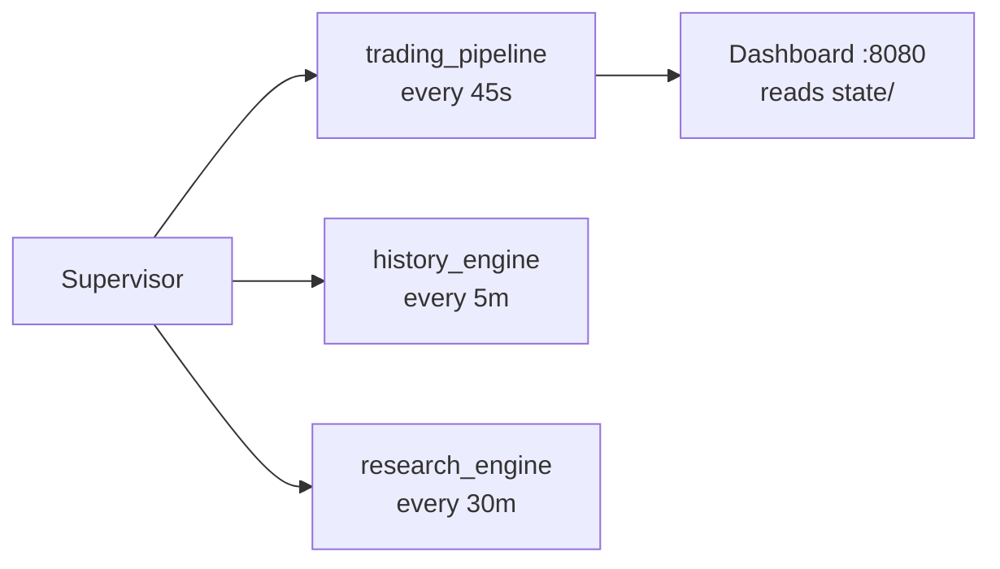
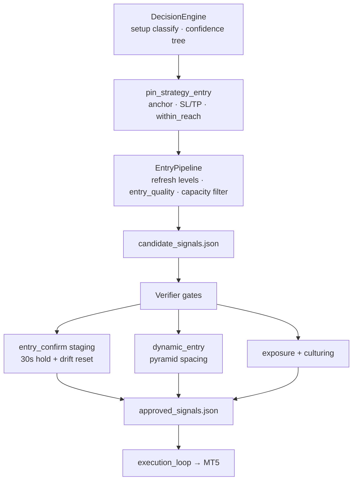
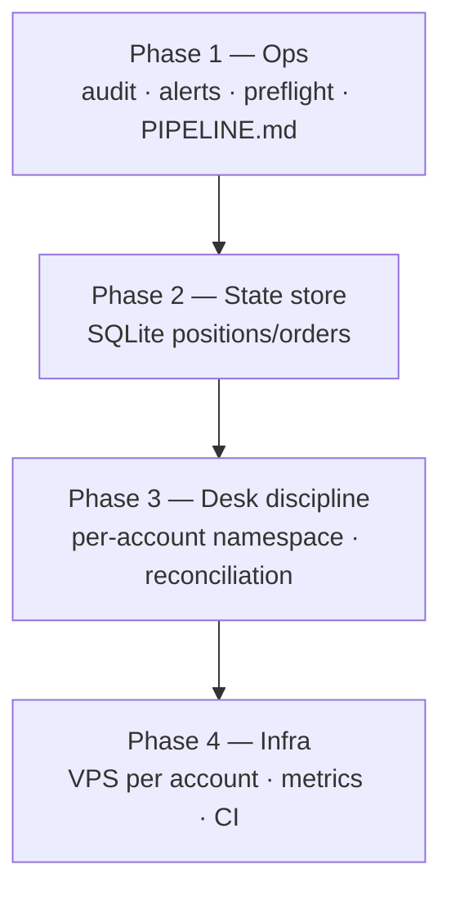

# MT5 Quant OS — Pipeline Architecture

Back to [README](../README.md) · [Phase 1 update](PHASE1_UPDATE.md) · [Structure](STRUCTURE.md) · [How to run](HOW_TO_RUN.md)

## Trading cycle (every ~45s)

Each supervisor tick runs **one sequential pipeline**. A failure in one loop is isolated — later loops still run.

## Background services (supervisor)

These run on their own intervals, **outside** the main trading pipeline:

## Entry strategy flow (signal → fill)

Improved entry path inside **signal_loop** and **verifier_loop**:

### Entry pipeline rules (`core/entry_pipeline.py`)

| Step | What it does |
|------|----------------|
| Capacity filter | Skip symbols already at `max_open_per_symbol` |
| Refresh levels | Re-pin entry/SL/TP to latest M5 bar each cycle |
| `entry_quality` | 0–100 score (anchor distance, reach, structure) |
| Unreachable drop | Skip limit entries where price is > `max_entry_wait_atr` from anchor |

Configure in `trading.strategy_entries` (enabled on `30-real` profile).

## State files (hot path)

**Phase 2:** Loops dual-write `state/quant_os.db` (SQLite) and JSON mirrors. See [PHASE2_UPDATE.md](PHASE2_UPDATE.md).

| File / store | Writer | Reader |
|--------------|--------|--------|
| `quant_os.db` → `signals` | signal_loop | verifier_loop |
| `quant_os.db` → `approved_signals` | verifier_loop | execution_loop |
| `features.json` | feature_loop | signal_loop |
| `candidate_signals.json` (mirror) | signal_loop | dashboard |
| `approved_signals.json` (mirror) | verifier_loop | dashboard |
| `paper_positions.json` | execution / position sync | risk, verifier, entry pipeline |
| `kill_switch.json` | risk_loop | verifier, execution |
| `audit_log.jsonl` | verifier, execution, risk | ops / forensics |

## Roadmap layers (hardening)

Phase 1: `audit_log.jsonl`, `ops.alerts` webhooks, `scripts/preflight.py`, entry pipeline refinement.

Phase 2 (current): `core/state_store.py`, dual-write SQLite + JSON mirrors, `scripts/migrate_json_state_to_sqlite.py`.