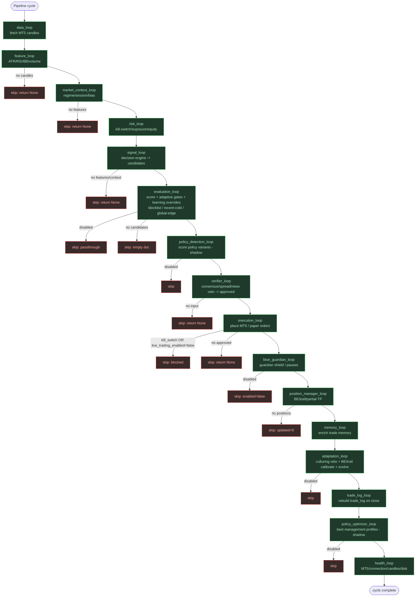
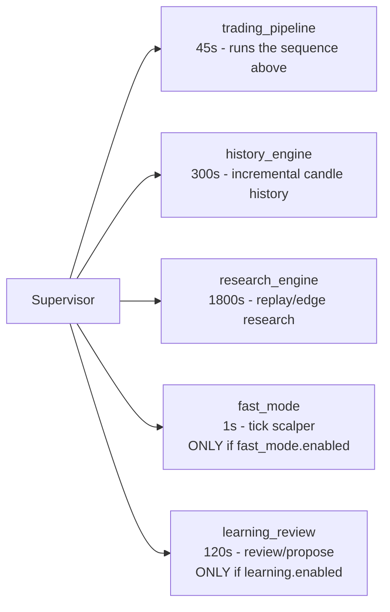

# Pipeline Review - MT5 Quant OS

Back to [README](../README.md) - [Pipeline](PIPELINE.md) - [Phase 2.4 Learning Loop](PHASE2.4_LEARNING_LOOP.md)

Full review of every part of the bot's decision pipeline: what runs, what is
skipped, and the order. The trading pipeline runs as a **sequential loop**
(`core/pipeline.py::run_pipeline`) every `app.loop_interval_seconds` (45s on
growth). Long-running engines + the new learning loop run as **parallel
supervisor services** on their own intervals. Each loop is fault-isolated: a
crash in one loop logs an error and the rest still run.

## Visual pipeline (sequential, per cycle)



## Parallel supervisor services (own intervals)



## Part-by-part status (current growth profile on demo)

| # | Part | Interval | Status now | Skips when | Reads | Writes |
|---|------|----------|------------|------------|-------|--------|
| 1 | data_loop | 45s | ACTIVE | never (always fetches) | MT5 ticks/candles | latest_candles.json, broker_symbols.json |
| 2 | feature_loop | 45s | ACTIVE | no candles -> None | latest_candles.json | features.json |
| 3 | market_context_loop | 45s | ACTIVE | no features -> None | features.json | market_context.json, regime_history.json |
| 4 | risk_loop | 45s | ACTIVE | never | account/positions/equity | risk_state.json, equity_history.json, kill_switch.json |
| 5 | signal_loop | 45s | ACTIVE | no features/context -> None | features + market_context + edge_scores | candidate_signals.json |
| 6 | evaluation_loop | 45s | ACTIVE (gating) | disabled -> passthrough; no candidates -> empty | candidates + paper_trades + edge_scores + adaptive_gates + learning_overrides | evaluated_signals.json, fast_signal_cache.json, adaptive_gates.json |
| 7 | policy_detection_loop | 45s | ACTIVE (shadow) | disabled -> skip | policy_scores | policy_scores.json |
| 8 | verifier_loop | 45s | ACTIVE | no candidate input -> None | evaluated_signals + features | approved_signals.json, rejected_signals.json |
| 9 | execution_loop | 45s | ACTIVE (orders) | kill_switch OR mt5+live_trading_enabled=false OR no approved | approved_signals | paper_orders.json, paper_positions.json, paper_trades.json |
| 10 | blue_guardian_loop | 45s | **SKIPPED** | blue_guardian.enabled=false | blue_guardian.json | blue_guardian_actions.json |
| 11 | position_manager_loop | 45s | ACTIVE (no-op if flat) | no positions -> updated=0 | paper_positions + features | position_management.json, SL mods via MT5 |
| 12 | memory_loop | 45s | ACTIVE | non-dict context | trade_log + memory | memory.json, learning_health.json |
| 13 | adaptation_loop | 45s | ACTIVE | adaptation.enabled=false | trade_log/edge/forward_test | symbol_policy_live.json, symbol_be_trail_live.json, adaptation_state.json |
| 14 | trade_log_loop | 45s | ACTIVE (throttled) | paper_trades unchanged | paper_trades + MT5 history | trade_log.json |
| 15 | policy_optimizer_loop | 45s | ACTIVE (shadow) | disabled -> skip | policy_scores + trades | best_policies.json |
| 16 | health_loop | 45s | ACTIVE (unhealthy*) | never | MT5 connection/candles/disk | health.json |
| - | history_engine | 300s | ACTIVE | never | MT5 history | history parquets, history_status.json |
| - | research_engine | 1800s | ACTIVE | never | features/edge/memory | research_validation.json, *_report |
| - | fast_mode | 1s | **SKIPPED** (growth) | fast_mode.enabled=false | fast_signal_cache + ticks | fast_mode_decisions.json, fast_mode_guard.json |
| - | learning_review | 120s | ACTIVE (observe_only) | learning.enabled=false | trade_log + latest_candles + overrides | learning_state.json, logs/*.jsonl, learning_config_overrides.json (only live_apply_limited) |

\* health_loop reports `unhealthy: mt5_terminal_not_running` from a flaky
terminal-path read (drive letter dropped) - cosmetic; MT5 is connected and
orders still send. See "known limitations" below.

## What is checked vs skipped right now

**Checked (running):** data, feature, market_context, risk, signal, evaluation
(with adaptive gates + symbol_blocklist[UK100m] + recent-cold + global-edge),
policy_detection (shadow), verifier, execution (mt5 live, blocked only by
market-closed retcode 10018), position_manager, memory, adaptation,
trade_log, policy_optimizer (shadow), health, history_engine, research_engine,
learning_review (observe_only).

**Skipped/disabled:** blue_guardian (enabled=false), fast_mode (disabled under
growth; active under 30-real). policy_detection & policy_optimizer run in
**shadow** (observe/score only, no auto-deploy). learning_review is
**observe_only** (logs only; no review/proposal/apply unless mode raised).

## Decision gates a signal must pass to trade

```mermaid
flowchart TD
    C[candidate generated] --> Q1{trade_score >= min?}
    Q1 -->|no| Rej[rejected]
    Q1 -->|yes| Q2{evaluation: policy_score >= min_policy_score?<br/>(adaptive: 35 normal / 45 cautious / 55 defensive)}
    Q2 -->|no| Skip[skip]
    Q2 -->|yes| Q3{symbol_blocklist?<br/>recent_cold (<20% last 8)?<br/>global_edge_cold (<20% all-time)?}
    Q3 -->|yes| Skip
    Q3 -->|no| Q4{verifier: consensus + spread + news blackout + regime + memory veto}
    Q4 -->|no| Rej
    Q4 -->|yes| Q5{execution: kill_switch? live_trading_enabled? market open?}
    Q5 -->|no| Blocked[blocked / market closed]
    Q5 -->|yes| Order[order placed]
```

## Recently fixed (this round)

- **health false-negative FIXED**: `MT5TerminalManager.is_alive()` now compares
  paths drive-insensitively + case-insensitively (psutil sometimes returns a
  process exe without the `C:` prefix). The `mt5_terminal_not_running` false
  alert is gone; health reads healthy when an interactive terminal is alive.
- **closed-market order spam FIXED**: `core/market_hours.py` records a per-symbol
  back-off (default 5 min, `execution.market_closed_backoff_minutes`) when an
  order fails with retcode 10018 / "Market closed" / "Trade disabled".
  `execution_loop` skips symbols in back-off and clears the back-off the moment
  an order fills (market reopened). No more retcode-10018 spam while oil/equities
  are closed.

## Remaining follow-ups

- **policy_optimizer/policy_detection in shadow**: they score but do not
  auto-deploy management profiles. The adaptive_gates + learning loop now cover
  the active adaptation; flipping the optimizer to `auto` is a separate
  decision (needs >=50 trades/cell).
- **git**: `.git` is read-only in this sandbox - changes are in the working
  tree, unstaged. Commit from a writable shell.
