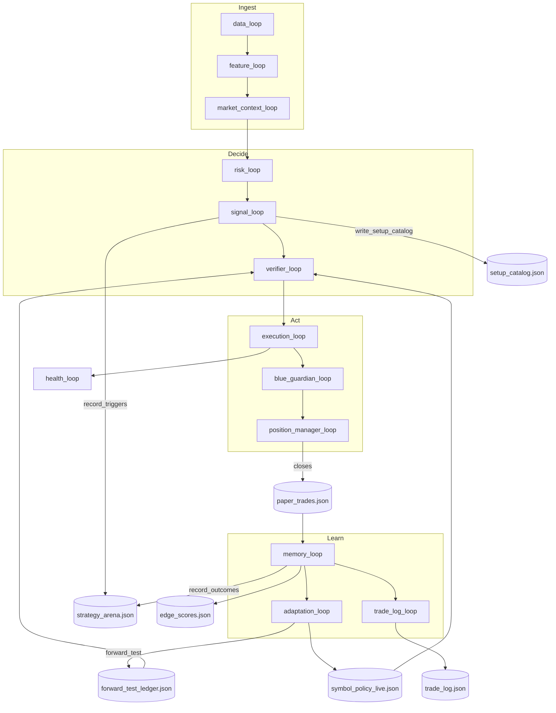

# Process Flow

End-to-end coordination from market data to learned adaptation.

## Signal → outcome chain

1. **signal_loop** classifies all 8 setups → `candidate_signals.json` + arena trigger log
2. **verifier_loop** applies culturing vetoes from [[Adaptation]] ledger
3. **execution_loop** places MT5 orders → `paper_orders.json` / `paper_positions.json`
4. **position_manager_loop** manages [[Exits]] → closes update `paper_trades.json`
5. **memory_loop** enriches closes → `edge_scores.json` + `record_outcomes` → arena analytics
6. **adaptation_loop** rebuilds ledger every cycle; calibrates BE/trail on new closes

## Arena analytics path

`record_outcomes` → `strategy_arena.json` analytics → `arena_insights.json` → TUI + `strategy_arena.log`

See [[Strategy Arena]].